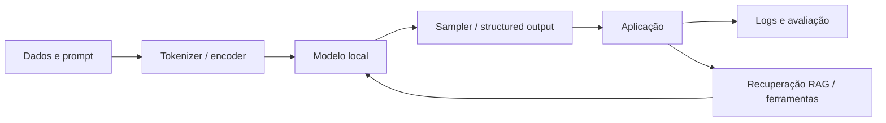

# Arquiteturas

## Famílias importantes

A arquitetura Transformer usa atenção e camadas feed-forward. Variantes modernas combinam GQA ou MQA para reduzir KV cache, RoPE ou alternativas para posição, MoE para aumentar capacidade com menos parâmetros ativos, e modelos multimodais com encoder visual ou fusão precoce.

| Arquitetura | Vantagem | Cuidado local |
|---|---|---|
| Dense decoder-only | Ecossistema amplo e previsível | Todos os parâmetros são usados em cada token. |
| MoE | Mais capacidade por FLOP ativo | Pesos totais, roteamento e comunicação podem dominar memória. |
| VLM | Imagens e documentos | Encoder, projetor e tokens visuais elevam custo. |
| State-space/híbrida | Potencial de contexto eficiente | Menor compatibilidade entre runtimes e ferramentas. |
| Embedding/reranker | Busca semântica e reordenação | Não substitui um gerador; exige pipeline RAG. |

## Camadas da solução

O desenho correto começa pelo fluxo de dados, não pelo modelo mais famoso. Em empresa, mantenha uma fronteira explícita entre dados não confiáveis recuperados, instruções do sistema e ações com efeitos colaterais.

**Referências**

[1]: https://arxiv.org/abs/1706.03762 "Attention Is All You Need"
[2]: https://ai.meta.com/blog/llama-4-multimodal-intelligence/ "Meta: Llama 4 e MoE multimodal"
