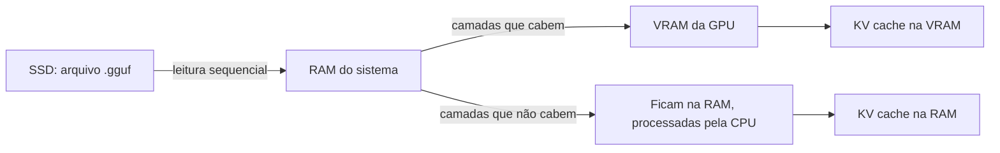

# Carregar um peso — o que acontece na memória e quando GPU, RAM e CPU trabalham

> **Pergunta que esta nota responde.** O que significa "carregar o modelo", por onde os pesos passam, o que fica na VRAM e o que fica na RAM, e em que momento cada peça de hardware está de fato trabalhando.

## 1. O que é um peso e o que é "carregar"

Um **peso** é um parâmetro do modelo gravado em disco ([[01-Fundamentos/Parametros-e-tokens]]). "Os pesos" são o arquivo inteiro — em casa, normalmente um `.gguf`, que reúne metadados e todos os tensores em um único arquivo pensado para ser mapeado direto na memória [2].

**Carregar** é levar esses números do disco para uma memória de onde o processador consegue lê-los rápido a cada token, e preparar as estruturas de trabalho. Concretamente, o runtime:

1. Lê os metadados do arquivo (arquitetura, número de camadas, vocabulário, quantização).
2. Decide **onde cada camada vai morar**: VRAM da GPU ou RAM do sistema.
3. Copia os tensores do SSD para a RAM e, dali, as camadas escolhidas para a VRAM.
4. Reserva o **KV cache** para o contexto pedido (`num_ctx`) — na VRAM para as camadas que estão na GPU, na RAM para as demais.
5. Aloca buffers de trabalho e carrega o tokenizer.
6. Fica esperando o primeiro prompt.

Carregar **não** é o mesmo que executar bem: um modelo pode abrir e falhar na primeira resposta longa, quando o KV cache cresce ([[05-Memoria-e-Performance/Inferencia-livro]], [[03-Hardware/Sizing-9B-14B-27B-70B]]).

## 2. O caminho dos pesos



Três cenários, do melhor para o pior:

| Cenário | Onde ficam os pesos | Quem calcula | Velocidade | Como reconhecer |
|---|---|---|---|---|
| **Tudo na GPU** | 100% na VRAM | GPU | A melhor possível para aquela placa | `ollama ps` mostra `100% GPU` [1] |
| **Parcial (offload)** | Parte na VRAM, parte na RAM | GPU para as suas camadas, CPU para as outras; ativações cruzam o barramento PCIe a cada token | Cai muito — a CPU e a banda da RAM viram o gargalo | `ollama ps` mostra algo como `40%/60% CPU/GPU` |
| **Só CPU** | 100% na RAM | CPU | A menor; limitada pela banda da RAM | `ollama ps` mostra `100% CPU`; sem GPU compatível ou modelo grande demais |

No llama.cpp, a divisão é controlada por `-ngl` / `--n-gpu-layers` (quantas camadas vão para a GPU) [3]; o Ollama decide automaticamente e usa a mesma técnica. Em máquinas de memória unificada (Apple Silicon, GB10, APUs), CPU e GPU leem a mesma memória e a divisão deixa de existir — o limite passa a ser a banda dessa memória única ([[03-Hardware/ARM-e-memoria-unificada]]).

## 3. Em que momento cada peça trabalha

| Momento | SSD | RAM | VRAM | CPU | GPU |
|---|---|---|---|---|---|
| Download do modelo | Grava | — | — | Pouco | — |
| **Carga** | Lê o arquivo (NVMe faz diferença aqui) | Recebe tudo de passagem; mantém o que não coube na VRAM | Recebe as camadas escolhidas + KV cache | Copia e organiza | Aloca |
| Tokenização da entrada | — | — | — | **Trabalha** (milissegundos) | — |
| **Prefill** (ler o prompt) | — | Se houver offload | KV cache cresce | Se houver offload | **Trabalha**: computação intensa e paralela |
| **Decode** (gerar tokens) | — | Se houver offload: a CPU lê seus pesos daqui a cada token | A GPU lê **todos** os pesos que estão aqui a cada token | Se houver offload; senão, quase ociosa | **Trabalha**, limitada pela banda da VRAM |
| Detokenização e exibição | — | — | — | Trabalha (pouco) | — |
| Modelo ocioso (até 5 min no Ollama, por padrão) | — | Mantém | **Mantém** os pesos alocados | — | Ociosa, mas com a VRAM ocupada |
| Descarga | — | Libera | Libera | — | — |
| **Embeddings para RAG** (indexar documentos) | Lê PDFs; grava o índice | Modelo de embedding + índice | Só se o runtime de embedding usar GPU | **Trabalha** (no vault, `torch` CPU) | Opcional |

Dois momentos merecem atenção:

- **Ocioso não é livre.** Enquanto o modelo está carregado, a VRAM continua ocupada. Se você abrir um segundo modelo, ou um jogo, ou outro processo de GPU, pode faltar memória mesmo sem ninguém "usando" a IA. No Ollama, `keep_alive` controla esse tempo [1].
- **Decode é o momento que define a experiência.** É quando a GPU lê os pesos inteiros dezenas de vezes por segundo. Por isso a **banda** da VRAM decide os tokens/s e por isso qualquer camada que ficou na RAM derruba a velocidade: a leitura passa a acontecer na banda da RAM, várias vezes menor ([[03-Hardware/Comparativo-workstations-vs-GPU]]).

## 4. Quanto de memória a carga pede

`memória_total ≈ pesos_quantizados + KV_cache(num_ctx) + workspace + runtime + folga` ([[05-Memoria-e-Performance/Modelo-de-memoria]]).

Exemplo real: `qwen3.5:4b` em Q4_K_M ocupa 3,4 GB de arquivo; com `num_ctx` 8192 coube inteiro em uma GPU de 8 GB (`100% GPU`) e a primeira resposta levou 9,3 s **incluindo a carga**, contra 0,9 s na pergunta seguinte, já carregado ([[07-Implementacao-Casa/Evidencias/RAG-reproducao-2026-09-01]]). O mesmo modelo com `num_ctx` de 32K ou 64K precisaria de mais KV cache e poderia deixar de caber. Calcule antes em [[03-Hardware/Calculadora-de-memoria]] e [[05-Memoria-e-Performance/KV-cache-formula-e-exemplos]].

## 5. Como ver com os próprios olhos

```bash
ollama run qwen3.5:4b        # carrega e abre o chat
ollama ps                    # em outro terminal: tamanho, processador (GPU/CPU) e tempo até descarregar
nvidia-smi                   # VRAM usada e utilização da GPU (NVIDIA)
```

No Windows, o Gerenciador de Tarefas mostra a memória dedicada da GPU e a RAM em uso; observe os dois durante a carga, durante uma resposta longa e depois de 5 minutos ociosos. No llama.cpp, o log de carga lista quantas camadas foram para a GPU e quanto o KV cache alocou [3].

Sintomas e diagnóstico rápido:

| Sintoma | Causa provável | Nota |
|---|---|---|
| Carga leva minutos | Arquivo em disco lento, ou RAM insuficiente forçando o sistema a paginar | [[03-Hardware/Por-que-VRAM-RAM-e-CPU-importam]] |
| `ollama ps` mostra parte em CPU | Modelo + KV cache maiores que a VRAM; reduza `num_ctx`, use quantização menor ou modelo menor | [[03-Hardware/Sizing-9B-14B-27B-70B]] |
| Resposta começa rápido e depois trava | KV cache estourou a memória no meio da geração | [[05-Memoria-e-Performance/KV-cache-formula-e-exemplos]] |
| Tokens/s caem com o tempo | Aquecimento (throttling) ou disputa de memória com outros processos | [[05-Memoria-e-Performance/Inferencia-livro]] |

*Última atualização: 2026-09-01. Próxima revisão: 2026-12-01.*

## Referências

[1]: https://docs.ollama.com/faq "Ollama — FAQ: `ollama ps` (processador GPU/CPU por modelo), keep_alive de 5 minutos, num_ctx"
[2]: https://github.com/ggml-org/ggml/blob/master/docs/gguf.md "GGUF — especificação: arquivo único, metadados, tensores alinhados, compatível com mmap"
[3]: https://github.com/ggml-org/llama.cpp/blob/master/docs/build.md "llama.cpp — backends de GPU (CUDA, Vulkan, Metal) e --n-gpu-layers"
[4]: https://docs.ollama.com/gpu "Ollama — suporte a GPU: NVIDIA (compute capability 5.0+), AMD ROCm, Apple Metal, Vulkan"
