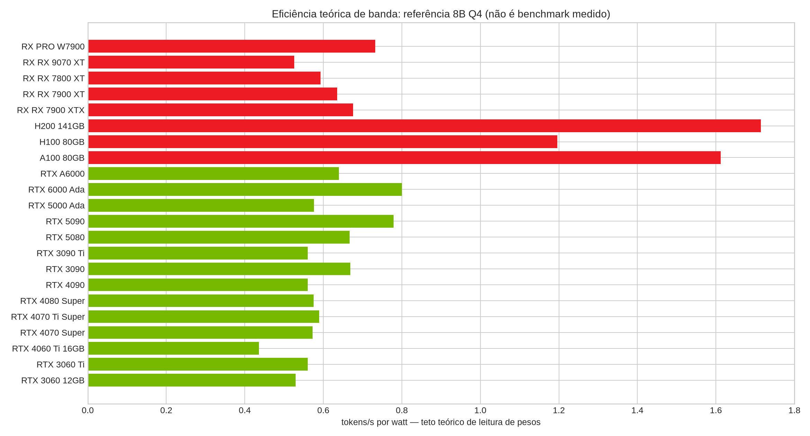
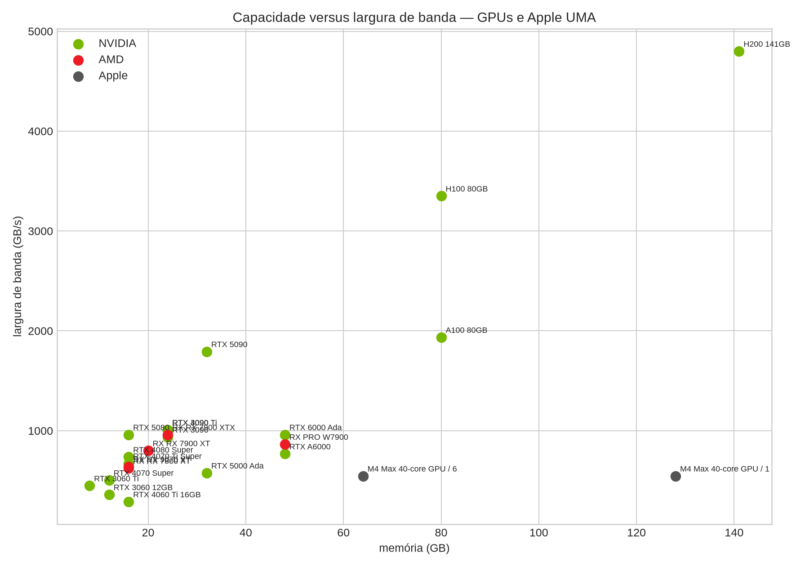

# AMD e Apple Silicon para IA local

**Data de verificação:** 1º de setembro de 2026. Este capítulo responde quais plataformas vale a pena manter no comparativo com NVIDIA e como interpretar capacidade de memória, banda, software e eficiência.

## Conclusão executiva

Vale a pena incluir a **Radeon RX 7900 XTX** como a principal placa AMD de consumo para comparação: seus 24 GB são relevantes para LLMs locais e sua banda de memória é competitiva. A **Radeon PRO W7900**, com 48 GB e ECC, merece uma linha profissional para modelos grandes, embora o custo e a variabilidade da pilha ROCm reduzam seu custo-benefício frente a NVIDIA CUDA em muitos cenários.

A **RX 9070 XT** e a **RX 7800 XT** são úteis como referências de 16 GB, mas não devem ser apresentadas como equivalentes automáticas à RTX 5090/4090 em IA. A decisão depende do suporte exato do modelo, runtime, sistema operacional, kernel e versão ROCm. Em AMD, “a placa tem capacidade” e “o workload funciona com bom desempenho” são afirmações diferentes.

Para Apple, o **M4 Max de 64 ou 128 GB** vale a pena como plataforma de memória unificada para inferência, RAG, coding, embeddings, STT/TTS e workloads multimodais compatíveis com Metal/MLX. Ele é especialmente interessante quando silêncio, eficiência, integração e memória compartilhada importam mais que máxima velocidade por real. O **M4 Ultra não deve ser incluído como produto de compra** sem ficha oficial: não foi encontrada confirmação oficial de lançamento nas fontes consultadas. A geração atual do Mac Studio deve ser registrada separadamente, sem retroatribuir especificações do M4.

## Matriz de inclusão

| Plataforma | Memória/banda de referência | Software | Vale incluir? | Melhor uso | Principal limitação |
|---|---:|---|---|---|---|
| RX 7900 XTX | 24 GB GDDR6; até 960 GB/s | ROCm/Linux, Vulkan, alguns caminhos Windows | Sim, prioridade alta | 8B/14B e 27B Q4; multi-GPU/offload para 70B | Compatibilidade por ROCm e runtime não é uniforme |
| RX 7900 XT | 20 GB GDDR6; até 800 GB/s | ROCm/Vulkan | Sim, prioridade média | 8B/14B e 27B Q4 ajustado | Menos margem que 24 GB |
| RX 7800 XT | 16 GB GDDR6; até 624 GB/s | ROCm/Vulkan | Sim, referência de entrada | 8B/14B; 27B Q4 curto | 16 GB e software podem limitar |
| RX 9070 XT | 16 GB GDDR6; confirmar matriz ROCm por versão | ROCm/Vulkan | Sim, com ressalva | 8B/14B e 27B Q4 apertado | Não publicar compatibilidade sem testar a combinação OS/kernel/ROCm |
| Radeon PRO W7900 | 48 GB GDDR6 ECC; confirmar ficha da SKU | ROCm/Linux/Vulkan | Sim, prioridade alta profissional | 27B–70B Q4 com contexto dimensionado | Preço e ecossistema menos previsíveis que CUDA |
| M4 Max 64 GB | 546 GB/s unified memory | Metal, MLX, MPS, llama.cpp | Sim, prioridade alta | 8B–70B conforme quantização/contexto; RAG/coding | Sem VRAM dedicada e sem CUDA |
| M4 Max 128 GB | 546 GB/s unified memory | Metal, MLX, MPS | Sim, prioridade alta | Modelos grandes, multimodalidade e contexto maior | O limite é compartilhado com o sistema e a velocidade depende do runtime |
| M4 Ultra | Não confirmado | Não publicar | Não como SKU | Apenas acompanhar anúncios oficiais | Não usar em BOM ou sizing até existir ficha oficial |

## O que a memória significa

Em uma GPU dedicada, VRAM é um orçamento separado para pesos, KV cache e buffers. Em Apple UMA, CPU e GPU compartilham a memória unificada. Isso permite carregar modelos que não caberiam na VRAM de uma placa isolada, mas o sistema operacional, aplicações e CPU competem pelo mesmo orçamento. “128 GB unificados” não equivale a 128 GB livres para pesos.

A regra de sizing permanece `memória útil = memória instalada - sistema - runtime - buffers - KV cache - margem`. Para modelos densos, o piso dos pesos é aproximadamente `parâmetros × bits / 8`; para MoE, parâmetros ativos reduzem computação, mas os experts totais ainda precisam ser armazenados de alguma forma.

## Software e compatibilidade AMD

O comparativo deve registrar a combinação completa: modelo, runtime, backend, sistema operacional, kernel, versão ROCm, driver e método de quantização. Linux tende a oferecer o caminho mais previsível para ROCm; Windows e Vulkan podem funcionar em determinados runtimes, mas não devem ser tratados como substitutos universais de CUDA. A matriz oficial ROCm e os releases do runtime devem ser consultados na data do teste.

A recomendação prática é validar primeiro um modelo pequeno, depois o modelo-alvo quantizado, e finalmente um teste de contexto e concorrência. Um modelo que carrega via Vulkan pode ter desempenho, kernels ou suporte de tool calling diferentes do mesmo modelo em ROCm/CUDA.

## Apple Silicon e runtimes

No Mac, priorize MLX para workloads que tenham implementação compatível, llama.cpp com Metal para GGUF e PyTorch MPS quando o operador estiver suportado. Ollama e LM Studio podem facilitar a operação, mas a medição precisa registrar backend efetivo e quantidade de memória usada. Para fine-tuning, LoRA/QLoRA pode ser viável em modelos menores, porém CUDA continua sendo o caminho mais amplo para bibliotecas de treinamento, kernels quantizados e serving multiusuário.

O M4 Max é forte em capacidade por memória e em eficiência do sistema, mas não deve ser comparado a uma RTX 4090 apenas pela banda nominal. A banda é de tipos de memória, arquitetura e padrão de acesso diferentes; tokens/s, TTFT, P50/P95 e potência na tomada precisam ser medidos no mesmo modelo e contexto.

## Gráficos

O primeiro gráfico apresenta um teto didático para um modelo de 8B Q4, calculado como `banda / 4 GB`, dividido pela potência da placa. Não é tokens/s observado e não representa custo financeiro. O Apple Silicon não aparece nesse gráfico porque a fonte oficial consultada não fornece TDP de chip comparável.

O segundo gráfico apresenta capacidade de memória contra largura de banda. Ele ajuda a localizar plataformas capazes de carregar modelos maiores, mas não mede qualidade, latência, compatibilidade ou velocidade de geração.

## Referências

[1]: https://www.amd.com/en/products/graphics/desktops/radeon/7000-series/amd-radeon-rx-7900xtx.html "AMD Radeon RX 7900 XTX"
[2]: https://www.amd.com/en/products/graphics/workstations/radeon-pro/w7900.html "AMD Radeon PRO W7900"
[3]: https://rocm.docs.amd.com/en/latest/ "AMD ROCm documentation"
[4]: https://www.apple.com/newsroom/2024/10/apple-introduces-m4-pro-and-m4-max/ "Apple introduces M4 Pro and M4 Max"
[5]: https://www.apple.com/mac-studio/ "Apple Mac Studio"
[6]: https://github.com/ml-explore/mlx "MLX — Apple machine learning framework"
[7]: https://github.com/ggerganov/llama.cpp "llama.cpp"
