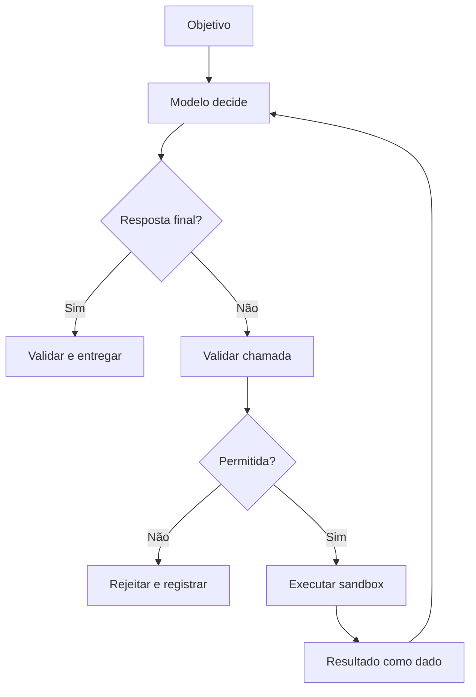

# AI Agents e tool calling — capítulo completo

## 1. Definição

Um agente é um sistema que usa um modelo para interpretar um objetivo, escolher ações, observar resultados e continuar até concluir ou atingir um limite. Tool calling é a interface estruturada entre o modelo e funções externas. Um chatbot com uma chamada fixa não é necessariamente um agente.

## 2. Ciclo de execução



O loop precisa de máximo de passos, timeout, limite de custo, limite de tokens, detecção de repetição e cancelamento. O resultado da ferramenta é dado não confiável; nunca deve alterar a política do sistema.

## 3. Contrato de ferramenta

Defina nome, descrição curta, JSON Schema de argumentos, permissões, efeitos, timeout, idempotência, erros e formato de retorno. Valide tipos e ranges no servidor. Não aceite `command` arbitrário quando uma operação enumerada resolve o problema.

```json
{"name":"run_tests","description":"Executa testes no repositório permitido","parameters":{"type":"object","properties":{"suite":{"type":"string","enum":["unit","integration"]}},"required":["suite"],"additionalProperties":false}}
```

## 4. Segurança

Use allowlist de ferramentas, diretório isolado, usuário sem privilégios, filesystem mínimo, rede bloqueada por padrão, secrets ausentes, limites de CPU/RAM, timeout e aprovação humana para efeitos externos. Ações irreversíveis, pagamentos, mensagens, deploy e alteração de produção exigem confirmação.

## 5. Estado e memória

Separe contexto da conversa, estado da tarefa, memória de longo prazo e evidências. Não grave tudo. Redija PII e segredos. Memória recuperada deve ter origem, ACL, validade e possibilidade de exclusão.

## 6. Avaliação

Teste sucesso, falha de ferramenta, JSON inválido, ferramenta indisponível, prompt injection, loops, alucinação de resultado e escalada de privilégio. Métricas: taxa de conclusão, passos, custo, latência, chamadas corretas, rejeições corretas e incidentes.

## 7. Implementação local

Use uma API compatível com OpenAI ou o protocolo do runtime, mas mantenha um dispatcher próprio que valide o schema antes de executar. Para coding, ferramentas mínimas são listar arquivos, ler arquivo, aplicar patch, executar testes e consultar busca local. Exija diff e revisão antes de escrever.

*Última atualização: 2026-09-01. Próxima revisão: 2026-10-01.*

## Referências

[1]: https://platform.openai.com/docs/guides/function-calling "Function calling e structured outputs"
[2]: https://docs.anthropic.com/en/docs/agents-and-tools/tool-use/overview "Tool use"
[3]: https://modelcontextprotocol.io/ "Model Context Protocol"
[4]: https://owasp.org/www-project-top-10-for-large-language-model-applications/ "OWASP LLM risks"
