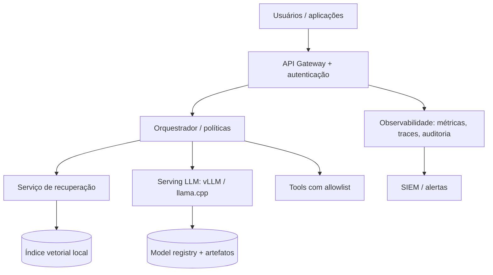

# Arquitetura de referência empresarial

Separe plano de dados, plano de controle e artefatos. O gateway autentica, aplica limites e remove dados indevidos. O orquestrador decide se pode recuperar, chamar ferramenta ou exigir aprovação. O serving deve ser stateless quando possível; estado de conversa deve ter retenção e criptografia definidas.

## Implantação por ondas

1. PoC em rede isolada com um caso de uso.
2. Piloto com usuários reais e avaliação cega.
3. Serviço interno com autenticação, logs e limites.
4. Alta disponibilidade, capacity planning, backup e patching.
5. Catálogo de modelos e processo de mudança.
